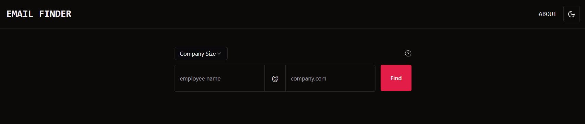
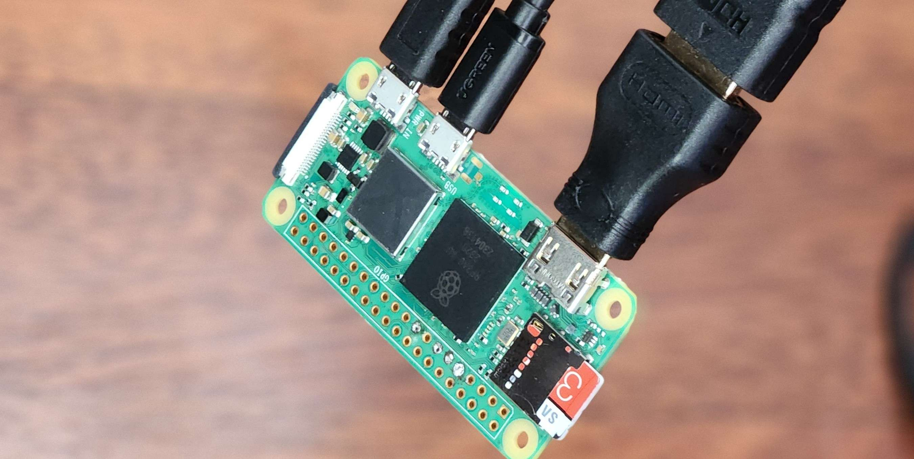
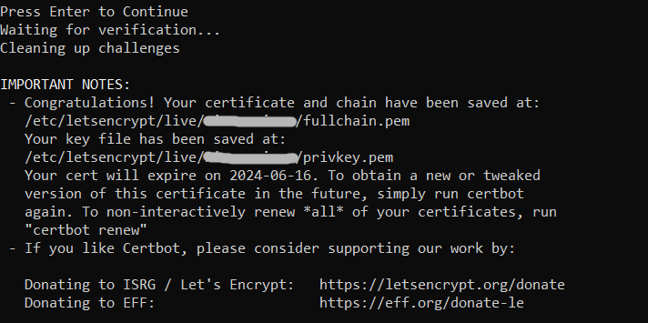
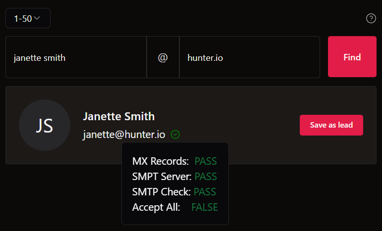

# Email Finder

[Email Finder](https://email-finder-jc.vercel.app) is a free website that generates and validates email addresses of employees.

It allows you to check if an email address exists for any employee without having to send a blind email out. Helpful for reaching out to recruiters or employees when applying for jobs. \
Check out the documentation [here](docs/email-verification-doc.md) to see how my verification server works.

# Motivation

I created this site to aid me on my job search. Often, when I need to contact a recruiter or an employee at a company I'm looking to apply to, it's difficult to get their contact info or even reach them on LinkedIn.

There are a few sites out there that help find an email, such as Hunter.io, which this project is based on. However, they only give a limited number of searches before you have to pull out the 'ol credit card :( \
So, as I often do, I started thinking about how I could make this myself. I thought, "They are probably just pinging the company's domain to check if an email exists. I could probably write an app to do that for me!" And so, this project was born.

While simple in concept and easy to get the individual parts working, getting them all to work together in production on the cloud was a great challenge. \
Read below to learn more about that wild journey.

# Features

-   Responsive design
-   Custom secure server
-   Color themes
-   Input response & validation

# Tech

### React + TypeScript + Vite + Vercel

-   Tailwind CSS
-   Eslint + Preiiter
-   Express js

> Website is hosted on Vercel and email verification server on a VPS.

# Feature Requests

-   [x] Use email format patterns based on a companie's size to suggest appropriate email
-   [ ] Account creation and lead saving
-   [ ] Backend - scrape domain website for any email to verify email domain
-   [ ] Backend - try multiple emails based on size and return whichever one is true, otherwise return most common as before

# What I Learned

-   How to use Tailwind CSS in a powerful way
-   Serverless functions, VPS, self hosting, https/http protocols
-   Responsive design with Tailwind
-   Testing with Vite and React

# Hosting is easy right?

So I thought, but it turns out there's a lot more nuance to it than I anticipated. The amount of iterations and late nights had me feeling like I was back in school again.

The trouble all started after I polished the app and decided it was ready for deployment to test it out live. Everything worked great locally `$ npm run dev`, however, when I deployed it... I had no response from email verificiation. I realized that the verifyEmail.js file which runs DNS check and other connections can't run in the browser because of security restrictions.

I promptly directed Vercel to host the file in a serverless function using `/api` directory and route any `/verifyEmail` requests there. I tested it out locally using `$ vercel dev` which worked swimmingly. Until deployment again when I quickly found out that the one port Vercel doesn't allow traffic on is 25, the only one I can use to verify email addresses :/ \
Turns out, none of the major hosting services such as AWS, Azure, and even DigitalOcean allow traffic on port 25 due to spam abuse. After a much research I still couldn't find a provider that didn't this port.

I decided that if no other cloud provider will help me, I'll just create my own server. So I spent the greater part of that night setting up this behemoth of a server:

  

Yes, a Raspberry Pi Zero, smaller than my index finger. I thought it would be sweet to have this little guy be the computer running my server in the background. It doesn't need to handle much compute anyway. I used an Express server and forwarded port 3001 on my router _(another timely procedure when you've lost the admin password)._

Alas, all good things must come to an end, but in this case... it didn't even make it past the starting line. So, never mind, I guess? The problem was that my ISP doesn't allow servers on their network, however, I thought that because it was a small personal project they wouldn't take notice. But I was niave and quickly found out they **automatically block** this traffic meaning that none of my `http:fowarded_rpi_ip:3001/...` requests ever reached the Pi.

Ready to cry but not ready to give up, I searched for another way. "That's it, I'm going to use whatever sketchy hosting service I can find that doesn't oppress port 25." \
Thankfully I managed to find a cheap VPS provider that was low on the sketch factor. I configured pretty fast since I had done it so many times at this point and it _actually worked_ but I didn't get my hopes up yet because I knew couldn't trust it in production. I deployed and bam, no more responses from the new server.
This time I discovered that browsers also block "mixed content", meaning my app can't be served over HTTPS and also be making HTTP requests.

So I was stuck again and this one wasn't going to be a quick fix. The solution was to configure my express server to communicate over HTTPS which means I need a SSL certificate. \
Just before I pulled out my wallet again, I discovered Let's Encrypt, a free open certificate authority. There's a tool called Certbot which does this conveniently through the CLI. \
To get a certificate using Certbot, you need a domain, not an IP address which is all a VPS has off the bat. Fortunately, I had an old unused domain which I could use so I created an A record in the DNS settings of this domain which points the domain to my VPS.
Now I could create the cirtificate and run my server securly.

    

I edited the IP tables to close the ports I previously used, 3001 and 80 (HTTP), and opened port 443 for HTTPS. To my astonishment Email Finder was working perfectly in production and my struggles were finally over.

    

What did I learn? Well, that I completely underestimated the backend for this site and that I could have profited greatly from an extra hour or two of research before starting this escapade ;)
